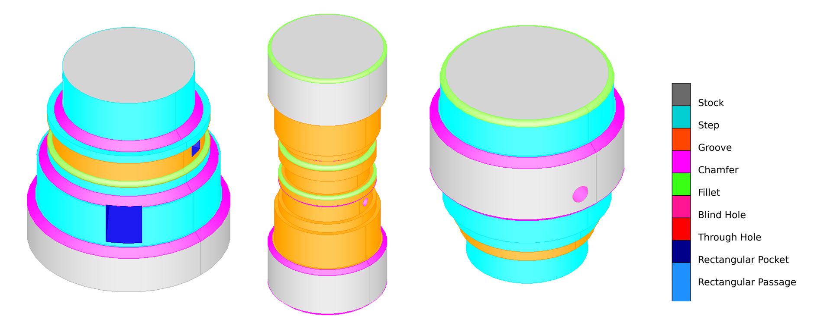
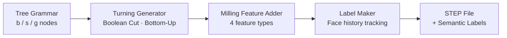

<div align="center">

# TurningMillingGenerator

**Procedural Synthetic Data Generator for CNC Turning-Milling Parts**

*Tree-grammar-driven 3D shape generation with automatic per-face semantic labeling*

---

<!-- TODO: Replace with a composite overview image (labeled shape grid + tree structure) -->
<!-- Suggested: combine results/trees/trees_grid.png + a few results/visualization/*/final_shape.png -->


</div>

---

## Table of Contents

- [Overview](#overview)
- [Architecture](#architecture)
- [Generated Results](#generated-results)
- [Label System](#label-system)
- [Getting Started](#getting-started)
- [Usage](#usage)
- [Project Structure](#project-structure)
- [Refactoring Highlights](#refactoring-highlights)
- [References](#references)

---

## Overview

### Background

Recent B-rep learning models such as **UV-Net** [[Jayaraman et al., CVPR 2021](#references)] demonstrate that neural networks operating directly on Boundary Representation (B-rep) data can outperform point cloud, voxel, and mesh-based approaches on 3D CAD tasks. For the **machining feature segmentation** task specifically — classifying each B-rep face as a turning or milling feature — the community relies on synthetic datasets like **MFCAD** and **MFCAD++** [[Colligan et al., CAD 2022](#references)], where labeled STEP files are generated programmatically using OpenCASCADE.

**TurningMillingGenerator** is a dataset generation engine built for this problem. It synthesizes turning-milling part geometries with automatically assigned per-face semantic labels, producing STEP files that can be fed directly into the UV-Net processing pipeline.

### Problem & Solution

Training deep learning models for **CNC machining feature recognition** requires large, accurately labeled 3D datasets. Manual annotation is expensive, inconsistent, and difficult to scale.

**TurningMillingGenerator** solves this by procedurally synthesizing turning-milling part geometries from a formal tree grammar, then automatically assigning semantic labels to every face using OpenCASCADE's Boolean operation history.

### Why This Approach

| Challenge | Solution |
|-----------|----------|
| Manual labeling is error-prone | Labels derived mathematically from Boolean operation history |
| Top-down generation skips features when space runs out | **Bottom-Up space allocation** guarantees all features are generated |
| Unconstrained generation produces physically impossible shapes | Tree grammar encodes real turning-machining geometric constraints |
| Pocket vs. passage visually similar but semantically different | Distinct label class for each (`RECTANGULAR_POCKET` / `RECTANGULAR_PASSAGE`) |

### Key Capabilities

- **Tree Grammar** (`b/s/g`) — enumerates all valid turning topologies within configurable constraints
- **Bottom-Up Generation** — leaf nodes compute required space first; parent allocates accordingly
- **Automatic Semantic Labeling** — OpenCASCADE face history (Modified/Generated/Deleted) drives per-face label propagation
- **4 Milling Feature Types** — blind hole, through hole, rectangular pocket, rectangular passage
- **STEP Export** — industry-standard format; compatible with the UV-Net B-rep preprocessing pipeline

---

## Architecture

### Domain Overview



The pipeline has three conceptual domains:

| Domain | Responsibility |
|--------|---------------|
| **Shape Grammar** | Enumerate valid CNC tree topologies; constrain Groove→Step, Base→Step≤2, etc. |
| **Geometry Engine** | Convert tree nodes to 3D solids via Boolean Cut; track modified/generated faces |
| **Semantic Labeling** | Map face history to 9 label classes; propagate through multi-step operations |

---

### Module-Level Structure

```
Application
  run_pipeline.py          Full orchestration: generate trees → shapes → save
  pipeline.py              TurningMillingGenerator (single entry point)
       │
       ▼
Domain  (core/)
  tree_generator.py        Enumerate all valid b/s/g tree structures
  turning_generator.py     Tree → 3D solid (Bottom-Up space allocation)
  milling_adder.py         Place 4 milling feature types on valid faces
  face_analyzer.py         Surface type detection & dimension extraction
  label_maker.py           Face history → per-face semantic label
  design_operation.py      Boolean Cut wrapper with history recording
       │
       ▼
Infrastructure  (utils/)
  tree_io.py               Tree serialization, filtering, statistics
  step_io.py               STEP file export
```

> **Dependency direction is strictly one-way**: Application → Domain → Infrastructure.  
> No upward imports exist after the refactoring.

---

### Bottom-Up Shape Generation

A naive top-down approach frequently **skips** child features when the parent has already consumed available space.  
The Bottom-Up strategy reverses this:

```
① Leaf nodes compute RequiredSpace (height, depth, margin)
   └─ propagated upward to each parent

② Root determines Stock dimensions
   └─ stock_height = required_height + random margin
   └─ stock_radius = required_depth + min_remaining_radius + margin

③ Root → Leaf: shapes are generated
   └─ space is already guaranteed → zero skips
```

---

## Generated Results

<!-- TODO: Insert a composite image of multiple final_shape.png views -->
<!-- Recommended layout: 3×3 grid of models with different canonical forms -->


Each model is named by its topology: `model_N{nodes}_S{steps}_G{grooves}_{id}`.

### Example Topologies Generated

| Canonical Form | Steps | Grooves | Description |
|---------------|-------|---------|-------------|
| `b(s,s(s(s(s))))` | 5 | 0 | Deep step chain with bidirectional base steps |
| `b(s(s(s(g,g))))` | 3 | 2 | Step chain terminating in sibling grooves |
| `b(g(g(g(g,g))))` | 0 | 5 | Pure groove nesting |
| `b(s(g(g(g,g))))` | 1 | 4 | Mixed step-groove hierarchy |

<!-- TODO: Add a labeled view (color-coded faces) from view_labeling.py output -->


---

## Label System

Labels are assigned per-face using OpenCASCADE's Boolean operation history:

- **Modified** faces retain the label of their origin face
- **Generated** faces (new geometry created by the operation) receive the label of the cutting tool

| ID | Class | Color (RGB) | Description |
|----|-------|-------------|-------------|
| 0 | `stock` | (105, 105, 105) | Base cylinder surface |
| 1 | `step` | (0, 206, 209) | Step (단차) lateral face |
| 2 | `groove` | (255, 69, 0) | Groove (홈) inner face |
| 3 | `chamfer` | (255, 0, 255) | Chamfered edge face |
| 4 | `fillet` | (57, 255, 20) | Filleted edge face |
| 5 | `blind_hole` | (255, 20, 147) | Blind hole inner surface |
| 6 | `through_hole` | (255, 0, 0) | Through hole inner surface |
| 7 | `rectangular_pocket` | (0, 0, 139) | Rectangular pocket (blind) |
| 8 | `rectangular_passage` | (30, 144, 255) | Rectangular passage (through) |

---

## Getting Started

### Prerequisites

| Dependency | Version | Notes |
|-----------|---------|-------|
| Python | 3.9 – 3.11 | 3.12+ not yet supported by pythonocc-core |
| pythonocc-core | 7.7.x | OpenCASCADE Python bindings |
| numpy | ≥ 1.24 | |
| matplotlib | ≥ 3.7 | Tree and milling visualization |
| pyvista | ≥ 0.43 | 3D visualization (optional) |

### Installation

**Recommended — conda (avoids native library conflicts):**

```bash
conda create -n occ python=3.11
conda activate occ
conda install -c conda-forge pythonocc-core numpy matplotlib
pip install pyvista
```

**Alternative — pip only:**

```bash
pip install pythonocc-core numpy matplotlib pyvista
```

### Clone & Run

```bash
git clone https://github.com/<your-username>/TurningMillingGenerator.git
cd TurningMillingGenerator

# Generate trees and 3D models (results saved to results/)
python run_pipeline.py
```

---

## Usage

### Basic Pipeline

```python
from pipeline import TurningMillingGenerator, TurningMillingParams
from core import TurningParams, FeatureParams, generate_trees

# 1. Generate tree structures
trees = generate_trees(n_nodes=6, max_depth=4)

# 2. Configure parameters
params = TurningMillingParams(
    turning=TurningParams(
        step_height_range=(2.0, 4.0),
        groove_width_range=(1.5, 3.0),
        edge_feature_prob=0.3,
    ),
    feature=FeatureParams(
        diameter_min=1.0,
        diameter_max_ratio=0.85,
        max_features_per_face=3,
    ),
    enable_milling=True,
    enable_labeling=True,
    max_holes=8,
)

# 3. Generate shape from a single tree
generator = TurningMillingGenerator(params)
shape, placements = generator.generate_from_tree(trees[0])

# 4. Save as STEP
generator.save("output/model.step")

# 5. Inspect generation metadata
info = generator.get_generation_info()
print(f"Stock: R={info['stock_radius']:.1f}mm, H={info['stock_height']:.1f}mm")
print(f"Milling features placed: {info['n_holes']}")
```

### Output Structure

Running `run_pipeline.py` produces:

```
results/
  trees/
    trees_N6_H4.json          Tree structure definitions
    trees_grid.png            Tree topology visualization
  step/
    model_N6_S3_G2_001_H7.step    Generated STEP file
    ...
  visualization/
    model_N6_S3_G2_001/
      feature_01_valid_faces.png  Valid milling faces at step 1
      ...
      final_shape.png             Final shape with all features
  generation_info.json          Per-model metadata (canonical, placements, dimensions)
```

### Tree Selection Strategy

The pipeline uses a **diversity-first** selection strategy:

1. Include ≥ 2 **bidirectional step** trees (Base has two Step children)
2. Include ≥ 2 **sibling groove** trees (a node has multiple Groove children)
3. Fill the remainder one-per-step-count for structural variety

---

## Project Structure

```
TurningMillingGenerator/
├── core/
│   ├── tree_generator.py       Tree enumeration with geometric constraints
│   ├── turning_generator.py    Bottom-Up 3D shape generation
│   ├── milling_adder.py        Milling feature placement & labeling
│   ├── face_analyzer.py        Surface type & dimension extraction
│   ├── label_maker.py          Face history → semantic label mapping
│   └── design_operation.py     Boolean Cut with history recording
├── utils/
│   ├── tree_io.py              Tree I/O, filtering, statistics
│   └── step_io.py              STEP file export
├── viz/
│   ├── tree_viz.py             Tree structure visualization
│   ├── milling_viz.py          Milling process step-by-step visualization
│   └── label_viz.py            Semantic label color rendering
├── config/
│   └── LABEL_PROPS.json        Label ID → name, RGB color mapping
├── tests/                      170 test cases across 8 modules
├── results/                    Generated outputs (STEP, JSON, images)
├── doc/                        Architecture specs and refactoring notes
├── pipeline.py                 TurningMillingGenerator entry point
└── run_pipeline.py             Full pipeline execution script
```

---

## Refactoring Highlights

This project underwent two structured refactoring rounds, documented in [`doc/refactoring/refactoring_plan.md`](doc/refactoring/refactoring_plan.md).

### Round 1 — Architecture & Bug Fixes

| Item | Problem | Fix |
|------|---------|-----|
| **Layer inversion** | `utils/` imported from `core/`; pipeline bypassed by `run_pipeline.py` | Enforced strict Application → Domain → Infrastructure dependency |
| **Dead code** | 6 legacy methods referenced non-existent fields (`AttributeError` on call) | Removed; `turning_generator.py` shrunk by 260 lines |
| **Null propagation** | `BRepAlgoAPI_Cut` result used without null check | Added `IsNull()` guard; raises `RuntimeError` on failure |
| **Missing label** | `RECTANGULAR_PASSAGE` reused pocket label (indistinguishable in training data) | Added label ID 8 across label constants, name list, and color config |
| **Unbounded recursion** | 5 recursive functions had no depth limit | Added `MAX_RECURSION_DEPTH = 50` guard |
| **Duplicate milling** | Same face could exceed `max_features_per_face` after Boolean Cut | Added `face_usage_count` dict; dual protection with `min_spacing` |

### Round 2 — Test Coverage

| Module | Test Cases |
|--------|-----------|
| `design_operation.py` | 16 |
| `label_maker.py` | 15 |
| `milling_adder.py` | 17 |
| `face_analyzer.py` | 17 |
| `tree_io.py` | 22 |
| `pipeline.py` (integration) | 11 |
| Pre-existing (`tree_generator`, `turning_generator`) | 72 |
| **Total** | **170 passed** |

---

---

## References

This project is designed to generate training data for B-rep learning models targeting CNC machining feature recognition. The following works provide the foundational context:

**[1] UV-Net: Learning from Boundary Representations**  
Pradeep Kumar Jayaraman, Aditya Sanghi, Joseph G. Lambourne, Karl D.D. Willis, Thomas Davies, Hooman Shayani, Nigel Morris  
*IEEE/CVF Conference on Computer Vision and Pattern Recognition (CVPR), 2021, pp. 11703–11712*  
[[Paper]](https://openaccess.thecvf.com/content/CVPR2021/html/Jayaraman_UV-Net_Learning_From_Boundary_Representations_CVPR_2021_paper.html) · [[arXiv]](https://arxiv.org/abs/2006.10211) · [[Code]](https://github.com/AutodeskAILab/UV-Net)

> Proposes a neural network that operates directly on B-rep data by encoding face/edge geometry via UV-grids and topology via a face-adjacency graph. The MFCAD dataset — synthetic STEP files labeled per B-rep face — is used for the machining feature segmentation task. This generator produces compatible STEP outputs.

**[2] Hierarchical CADNet: Learning from B-Reps for Machining Feature Recognition**  
Andrew Colligan, Trevor T. Robinson, Declan C. Nolan, Yang Hua, Weijuan Cao  
*Computer-Aided Design, Volume 147, 2022*  
[[Paper]](https://www.sciencedirect.com/science/article/pii/S0010448522000240) · [[Dataset (MFCAD++)]](https://pure.qub.ac.uk/en/datasets/mfcad-dataset-dataset-for-paper-hierarchical-cadnet-learning-from/)

> Extends B-rep learning with a hierarchical graph representation for machining feature recognition. Introduces **MFCAD++** (59,665 samples), a synthetic dataset generated using PythonOCC and saved as STEP files with per-face labels — the same methodology used in this project.

```bibtex
@InProceedings{Jayaraman_2021_CVPR,
  author    = {Jayaraman, Pradeep Kumar and Sanghi, Aditya and Lambourne, Joseph G. and
               Willis, Karl D.D. and Davies, Thomas and Shayani, Hooman and Morris, Nigel},
  title     = {UV-Net: Learning From Boundary Representations},
  booktitle = {Proceedings of the IEEE/CVF Conference on Computer Vision and Pattern Recognition (CVPR)},
  month     = {June},
  year      = {2021},
  pages     = {11703-11712}
}

@article{Colligan2022,
  author  = {Colligan, Andrew and Robinson, Trevor T. and Nolan, Declan C. and
             Hua, Yang and Cao, Weijuan},
  title   = {Hierarchical {CADNet}: Learning from {B-Reps} for Machining Feature Recognition},
  journal = {Computer-Aided Design},
  volume  = {147},
  year    = {2022},
  doi     = {10.1016/j.cad.2022.103226}
}
```

---

<div align="center">

Built with [pythonocc-core](https://github.com/tpaviot/pythonocc-core) (OpenCASCADE) · Python 3.11

</div>
