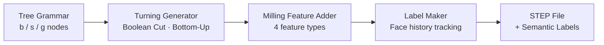
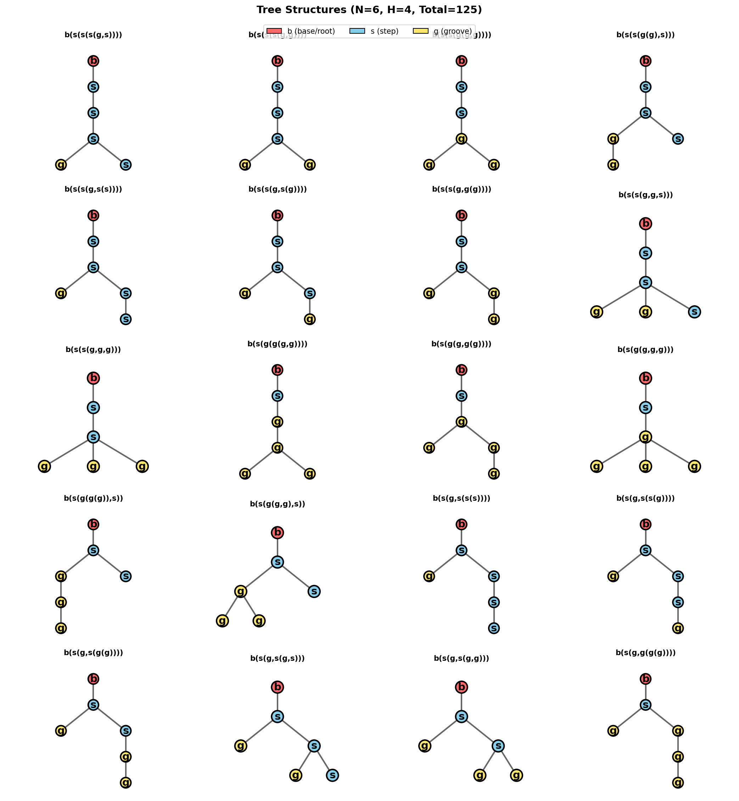
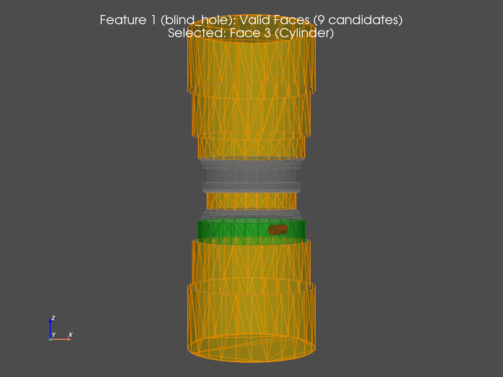
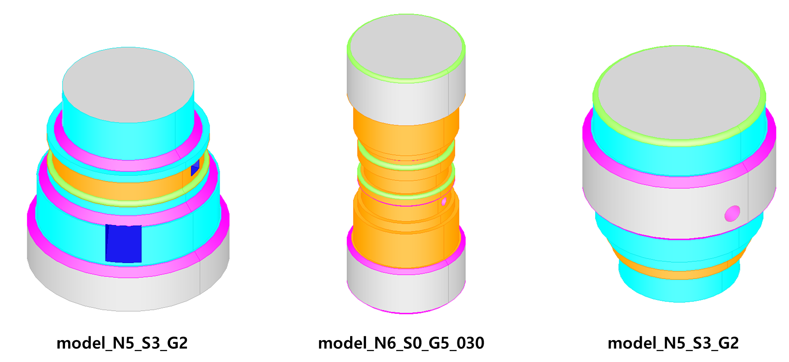

<div align="center">

# TurningMillingGenerator

**Procedural Synthetic Data Generator for CNC Turning-Milling Parts**

*Tree-grammar-driven 3D shape generation with automatic per-face semantic labeling*

---


</div>

---

## Table of Contents

- [Overview](#overview)
- [Architecture](#architecture)
- [Generated Results](#generated-results)
- [Label System](#label-system)
- [Getting Started](#getting-started)
- [Usage](#usage)
- [Project Structure](#project-structure)
- [Refactoring Highlights](#refactoring-highlights)
- [References](#references)

---

## Overview

### Background

Recent B-rep learning models such as **UV-Net** [[Jayaraman et al., CVPR 2021](#references)] demonstrate that neural networks operating directly on Boundary Representation (B-rep) data can outperform point cloud, voxel, and mesh-based approaches on 3D CAD tasks. For the **machining feature segmentation** task specifically — classifying each B-rep face as a turning or milling feature — the community relies on synthetic datasets like **MFCAD** and **MFCAD++** [[Colligan et al., CAD 2022](#references)], where labeled STEP files are generated programmatically using OpenCASCADE.

**TurningMillingGenerator** is a dataset generation engine built for this problem. It synthesizes turning-milling part geometries with automatically assigned per-face semantic labels, producing STEP files that can be fed directly into the UV-Net processing pipeline.

### Why This Approach

| Challenge | Solution |
|-----------|----------|
| Manual labeling is error-prone | Labels derived mathematically from Boolean operation history |
| Top-down generation skips features when space runs out | **Bottom-Up space allocation** guarantees all features are generated |
| Unconstrained generation produces physically impossible shapes | Tree grammar encodes real turning-machining geometric constraints |
| Pocket vs. passage visually similar but semantically different | Distinct label class for each (`RECTANGULAR_POCKET` / `RECTANGULAR_PASSAGE`) |

### Key Capabilities

- **Tree Grammar** (`b/s/g`) — enumerates all valid turning topologies within configurable constraints
- **Bottom-Up Generation** — leaf nodes compute required space first; parent allocates accordingly
- **Automatic Semantic Labeling** — OpenCASCADE face history (Modified/Generated/Deleted) drives per-face label propagation
- **4 Milling Feature Types** — blind hole, through hole, rectangular pocket, rectangular passage
- **STEP Export** — industry-standard format; compatible with the UV-Net B-rep preprocessing pipeline

---

## Architecture

### Domain Overview



The pipeline has three conceptual domains:

| Domain | Responsibility |
|--------|---------------|
| **Shape Grammar** | Enumerate valid CNC tree topologies; constrain Groove→Step, Base→Step≤2, etc. |
| **Geometry Engine** | Convert tree nodes to 3D solids via Boolean Cut; track modified/generated faces |
| **Semantic Labeling** | Map face history to 9 label classes; propagate through multi-step operations |

---

### Module-Level Structure

```
Application
  run_pipeline.py          Full orchestration: generate trees → shapes → save
  pipeline.py              TurningMillingGenerator (single entry point)
       │
       ▼
Domain  (core/)
  tree_generator.py        Enumerate all valid b/s/g tree structures
  turning_generator.py     Tree → 3D solid (Bottom-Up space allocation)
  milling_adder.py         Place 4 milling feature types on valid faces
  face_analyzer.py         Surface type detection & dimension extraction
  label_maker.py           Face history → per-face semantic label
  design_operation.py      Boolean Cut wrapper with history recording
       │
       ▼
Infrastructure  (utils/)
  tree_io.py               Tree serialization, filtering, statistics
  step_io.py               STEP file export
```

> **Dependency direction is strictly one-way**: Application → Domain → Infrastructure.  
> No upward imports exist after the refactoring.

---

### Bottom-Up Shape Generation

A naive top-down approach frequently **skips** child features when the parent has already consumed available space.  
The Bottom-Up strategy reverses this:

```
① Leaf nodes compute RequiredSpace (height, depth, margin)
   └─ propagated upward to each parent

② Root determines Stock dimensions
   └─ stock_height = required_height + random margin
   └─ stock_radius = required_depth + min_remaining_radius + margin

③ Root → Leaf: shapes are generated
   └─ space is already guaranteed → zero skips
```

---

### Tree Grammar & Topology Enumeration

The tree grammar uses three node types to encode all valid CNC turning topologies:

| Node | Symbol | Meaning | Constraints |
|------|--------|---------|-------------|
| Base | `b` | Root — cylindrical stock | Always exactly 1, at root |
| Step | `s` | 단차 (diameter reduction) | Base→Step ≤ 2, Step→Step ≤ 1 |
| Groove | `g` | 홈 (circumferential groove) | Groove→Step forbidden |

The `Groove → Step` constraint reflects a physical machining reality: a groove is too narrow (1.5–3 mm) to fit a step height (2–4 mm) inside it.

All unique tree structures within given node count `N` and depth `H` are **exhaustively enumerated** and deduplicated via a canonical string form (e.g. `b(s,s(g))`). The `generate_balanced_sample()` method then draws a diversity-weighted subset, ensuring different step/groove count ratios are represented.



*All valid topologies for N=6, H=4 — each cell shows the canonical form and tree diagram.*

---

### Milling Feature Placement

After the turning shape is generated, the `MillingFeatureAdder` scans every B-rep face to find **valid placement targets**:

```
① FaceAnalyzer inspects each face
   └─ surface type: Cylinder / Plane / Cone
   └─ dimensions: width (W), height (H) extracted from bounding geometry

② Validity filter
   └─ feature scale ≤ min(W, H) − 2 × clearance
   └─ only lateral surfaces accepted (top/bottom planes excluded)

③ Feature placement
   └─ center sampled on the valid face
   └─ direction set normal to the surface
   └─ min_spacing enforced between features on the same face
   └─ face_usage_count tracked → max_features_per_face respected
```

The image below shows valid faces (highlighted) detected on the turning shape before each milling feature is added:



*Highlighted faces are candidates for the next milling feature placement.*

---

## Generated Results



Each model is named by its topology: `model_N{nodes}_S{steps}_G{grooves}_{id}`.

### Example Topologies Generated

| Canonical Form | Steps | Grooves | Description |
|---------------|-------|---------|-------------|
| `b(s,s(s(s(s))))` | 5 | 0 | Deep step chain with bidirectional base steps |
| `b(s(s(s(g,g))))` | 3 | 2 | Step chain terminating in sibling grooves |
| `b(g(g(g(g,g))))` | 0 | 5 | Pure groove nesting |
| `b(s(g(g(g,g))))` | 1 | 4 | Mixed step-groove hierarchy |

---

## Label System

Labels are assigned per-face using OpenCASCADE's Boolean operation history:

- **Modified** faces retain the label of their origin face
- **Generated** faces (new geometry created by the operation) receive the label of the cutting tool

| ID | Class | Color (RGB) | Description |
|----|-------|-------------|-------------|
| 0 | `stock` | (105, 105, 105) | Base cylinder surface |
| 1 | `step` | (0, 206, 209) | Step (단차) lateral face |
| 2 | `groove` | (255, 69, 0) | Groove (홈) inner face |
| 3 | `chamfer` | (255, 0, 255) | Chamfered edge face |
| 4 | `fillet` | (57, 255, 20) | Filleted edge face |
| 5 | `blind_hole` | (255, 20, 147) | Blind hole inner surface |
| 6 | `through_hole` | (255, 0, 0) | Through hole inner surface |
| 7 | `rectangular_pocket` | (0, 0, 139) | Rectangular pocket (blind) |
| 8 | `rectangular_passage` | (30, 144, 255) | Rectangular passage (through) |

---

## Getting Started

### Requirements

| Dependency | Version | Role |
|-----------|---------|------|
| Python | 3.10 – 3.12 | Recommended range; 3.11 tested |
| pythonocc-core | ≥ 7.7.2 | OpenCASCADE Python bindings (core geometry engine) |
| numpy | ≥ 1.24 | Numerical operations |
| matplotlib | ≥ 3.7 | Tree and milling process visualization |
| pyvista | ≥ 0.43 | 3D interactive viewer (optional) |

> **Note on pythonocc-core:** Native C++ bindings make conda the most reliable install path.  
> pip install also works, but may require a pre-built wheel matching your OS and Python version.

---

### Step 1 — Clone the repository

```bash
git clone https://github.com/<your-username>/TurningMillingGenerator.git
cd TurningMillingGenerator
```

---

### Step 2 — Set up the environment

**Option A: conda (recommended)**

Uses `environment.yml` included in the repo — one command sets up everything:

```bash
conda env create -f environment.yml
conda activate occ
```

**Option B: pip**

```bash
python -m venv .venv

# Windows
.venv\Scripts\activate

# macOS / Linux
source .venv/bin/activate

pip install -r requirements.txt
```

---

### Step 3 — Verify the installation

```bash
python -c "from OCC.Core.BRepPrimAPI import BRepPrimAPI_MakeCylinder; print('pythonocc-core OK')"
```

Expected output:
```
pythonocc-core OK
```

> If you see a `SWIG DeprecationWarning`, that is a known cosmetic issue in the OpenCASCADE bindings and can be safely ignored.

---

### Step 4 — Run the pipeline

```bash
# Full pipeline: generate trees → 3D shapes → save STEP + JSON + images
python run_pipeline.py
```

Results are saved to `results/`. See [Output Structure](#output-structure) for details.

---

## Usage

### Basic Pipeline

```python
from pipeline import TurningMillingGenerator, TurningMillingParams
from core import TurningParams, FeatureParams, generate_trees

# 1. Generate tree structures
trees = generate_trees(n_nodes=6, max_depth=4)

# 2. Configure parameters
params = TurningMillingParams(
    turning=TurningParams(
        step_height_range=(2.0, 4.0),
        groove_width_range=(1.5, 3.0),
        edge_feature_prob=0.3,
    ),
    feature=FeatureParams(
        diameter_min=1.0,
        diameter_max_ratio=0.85,
        max_features_per_face=3,
    ),
    enable_milling=True,
    enable_labeling=True,
    max_holes=8,
)

# 3. Generate shape from a single tree
generator = TurningMillingGenerator(params)
shape, placements = generator.generate_from_tree(trees[0])

# 4. Save as STEP
generator.save("output/model.step")

# 5. Inspect generation metadata
info = generator.get_generation_info()
print(f"Stock: R={info['stock_radius']:.1f}mm, H={info['stock_height']:.1f}mm")
print(f"Milling features placed: {info['n_holes']}")
```

### Output Structure <a name="output-structure"></a>

Running `run_pipeline.py` produces:

```
results/
  trees/
    trees_N6_H4.json          Tree structure definitions
    trees_grid.png            Tree topology visualization
  step/
    model_N6_S3_G2_001_H7.step    Generated STEP file
    ...
  visualization/
    model_N6_S3_G2_001/
      feature_01_valid_faces.png  Valid milling faces at step 1
      ...
      final_shape.png             Final shape with all features
  generation_info.json          Per-model metadata (canonical, placements, dimensions)
```

### Tree Selection Strategy

The pipeline uses a **diversity-first** selection strategy:

1. Include ≥ 2 **bidirectional step** trees (Base has two Step children)
2. Include ≥ 2 **sibling groove** trees (a node has multiple Groove children)
3. Fill the remainder one-per-step-count for structural variety

---

## Project Structure

```
TurningMillingGenerator/
├── core/
│   ├── tree_generator.py       Tree enumeration with geometric constraints
│   ├── turning_generator.py    Bottom-Up 3D shape generation
│   ├── milling_adder.py        Milling feature placement & labeling
│   ├── face_analyzer.py        Surface type & dimension extraction
│   ├── label_maker.py          Face history → semantic label mapping
│   └── design_operation.py     Boolean Cut with history recording
├── utils/
│   ├── tree_io.py              Tree I/O, filtering, statistics
│   └── step_io.py              STEP file export
├── viz/
│   ├── tree_viz.py             Tree structure visualization
│   ├── milling_viz.py          Milling process step-by-step visualization
│   └── label_viz.py            Semantic label color rendering
├── config/
│   └── LABEL_PROPS.json        Label ID → name, RGB color mapping
├── tests/                      170 test cases across 8 modules
├── results/                    Generated outputs (STEP, JSON, images)
├── doc/                        Architecture specs and refactoring notes
├── environment.yml             conda environment definition (recommended)
├── requirements.txt            pip dependency list
├── pipeline.py                 TurningMillingGenerator entry point
└── run_pipeline.py             Full pipeline execution script
```

---

## References

This project is designed to generate training data for B-rep learning models targeting CNC machining feature recognition. The following works provide the foundational context:

**[1] UV-Net: Learning from Boundary Representations**  
Pradeep Kumar Jayaraman, Aditya Sanghi, Joseph G. Lambourne, Karl D.D. Willis, Thomas Davies, Hooman Shayani, Nigel Morris  
*IEEE/CVF Conference on Computer Vision and Pattern Recognition (CVPR), 2021, pp. 11703–11712*  
[[Paper]](https://openaccess.thecvf.com/content/CVPR2021/html/Jayaraman_UV-Net_Learning_From_Boundary_Representations_CVPR_2021_paper.html) · [[arXiv]](https://arxiv.org/abs/2006.10211) · [[Code]](https://github.com/AutodeskAILab/UV-Net)

> Proposes a neural network that operates directly on B-rep data by encoding face/edge geometry via UV-grids and topology via a face-adjacency graph. The MFCAD dataset — synthetic STEP files labeled per B-rep face — is used for the machining feature segmentation task. This generator produces compatible STEP outputs.

**[2] Hierarchical CADNet: Learning from B-Reps for Machining Feature Recognition**  
Andrew Colligan, Trevor T. Robinson, Declan C. Nolan, Yang Hua, Weijuan Cao  
*Computer-Aided Design, Volume 147, 2022*  
[[Paper]](https://www.sciencedirect.com/science/article/pii/S0010448522000240) · [[Dataset (MFCAD++)]](https://pure.qub.ac.uk/en/datasets/mfcad-dataset-dataset-for-paper-hierarchical-cadnet-learning-from/)

> Extends B-rep learning with a hierarchical graph representation for machining feature recognition. Introduces **MFCAD++** (59,665 samples), a synthetic dataset generated using PythonOCC and saved as STEP files with per-face labels — the same methodology used in this project.

---

<div align="center">

Built with [pythonocc-core](https://github.com/tpaviot/pythonocc-core) (OpenCASCADE) · Python 3.11

</div>
